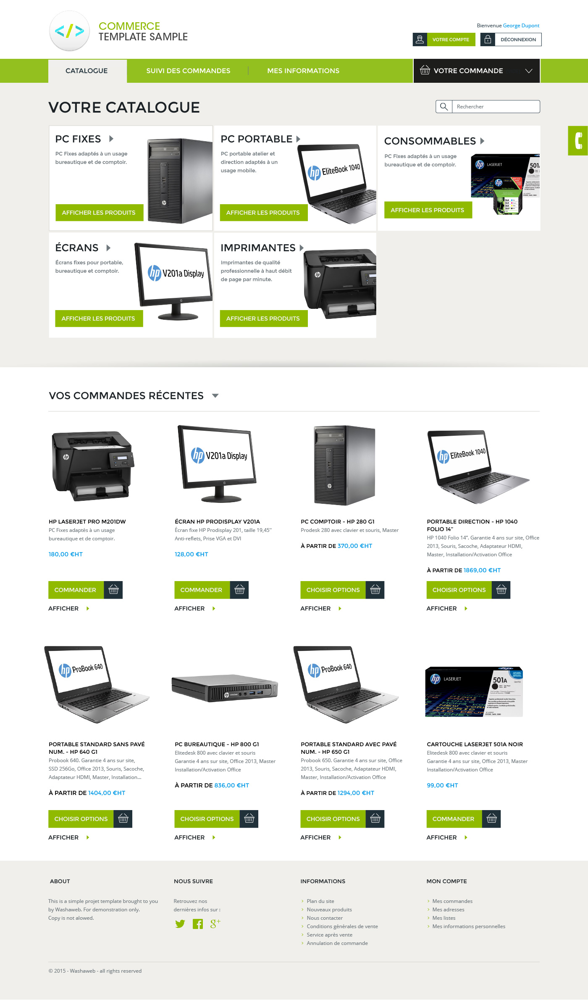

Website Mockup viewer
=====================

Mockup Viewer is a simple and elegant tool used by website designers for presenting their work to their clients. "Mockup Viewer" presents the website prototypes in a browser window and helps clients to figure out the final render of web pages instead of looking at simple screenshots.

It is based on the excellent [Transition.js](https://github.com/icodebuster/transition.js) library created by Codrops.

**You can watch a working demo [here](http://www.washaweb.com/mockup-viewer/)**

Features
--------
* Next page transition.
* Previous page transition.
* Go to star / end page.
* Add custom animation.
* Add a list of animation to be played randomly.

Install
-------

Copy this repo to a webserver once you've edited your slides and just launch the index.html page in a browser.

Getting Started
---------------

### Prepare your slides

Place your mockups `.jpg` or `.png` files in the `images/` folder (default 1400px width) - if you need to set another image width, you'll have to edit the `css/main.css` file like this

    .pt-page img {
        width: 100%;
        /* Edit your custom width : */
        max-width: 1400px;
        /* end custom width */
        height: auto;
        margin: 0px auto;
    }

Replace `logo.png` with your own file.

Edit `index.html` to create/dupplicate/edit your slides and add your own texts.

HTML markup
-----------

### Text slide

Each slide is constituted by a simple html markup :

    

        <article>
            <h1><strong>Page title</strong></h1>
            
Your baseline texte here.

        </article>
    
 

**.pt-page**  - Add this class to all the individual pages.
**.pt-text**  - This is used for text pages and contains an `article` used to center verticaly the slide content.
Inside the `article`, you can use any html you want as long as you add your own CSS rules to go with it.

### Image/mockup slide

The Markup for image slides is slightly different :

    

        <figure>
            
        </figure>
    

A `figure` tag is used to display scrollbars on very long contents.

### Navigation buttons

When your slides will be ready, **you will have** to adjust the data-goto slide number on the **"last page" button**. Otherwise you will get a javascript error.

    <button id="endpage" class="pt-trigger" data-animation="53" data-goto="{place the slide count number here (slide count starting from zero)}"><i class="fa fa-arrow-circle-o-down"></i> End</button>

 * **data-goto** - This attribute is added to `.pt-trigger` element, with values `-1` or `-2` or any valid page number starting from 1 inside the **`.pt-wrapper`**.
 * **data-goto="-1"** trigger next page.
 * **data-goto="-2"** trigger previous page.
 * **data-goto="10"** trigger to go to page 10.

You can also change the **data-animation** attribute with values between `1` to `67`. If you need random animation then the values should be separated by **`-`** :

 * **data-animation="57"** it does the 57th animation.
 * **data-animation="50-51-52-53-54"** it does a random animation from the list.
 * Please refer to [this page](http://tympanus.net/Development/PageTransitions/) for grabbing other awesome transitions.

Credits 
-------
Thanks to Codrops and Icodebuster for their work.
* https://github.com/icodebuster/transition.js
* http://tympanus.net/codrops/2013/05/07/a-collection-of-page-transitions/

License
-------
All the css animations in animation.css were written by Codrops and therefore fall under [their license](http://tympanus.net/codrops/licensing/).
All other source code is released under the MIT License.
